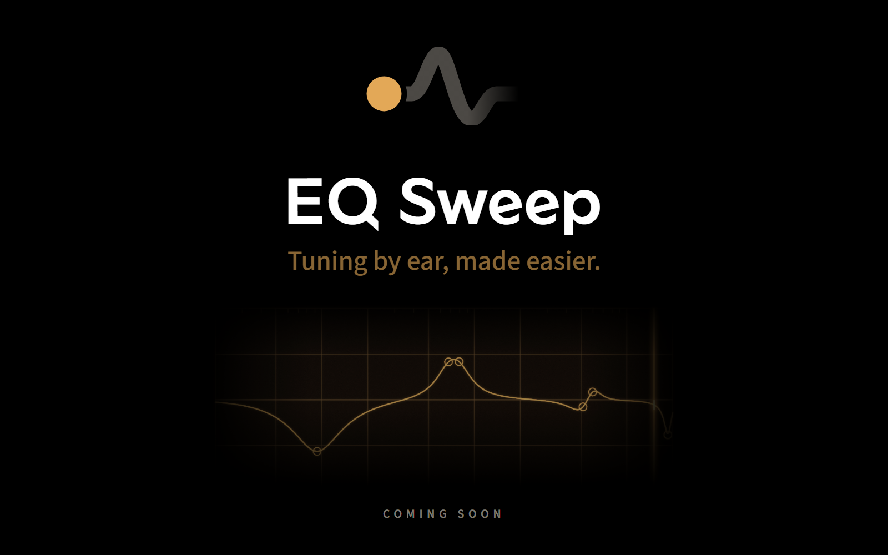

  

  An Android app for tuning your headphones by ear. 
  <b>Now in beta testing on Google Play - free, with no ads.</b> 
  <a href="https://eqsweep.app/">eqsweep.app</a> · <a href="https://eqsweep.app/#beta">Join the beta</a>

## How it is released

- **Google Play only.** The app is in a closed beta test now - [join it on eqsweep.app](https://eqsweep.app/#beta). There is no date for the public release yet.
- **The app will be free, with no ads.**
- **The app is closed source.** This repository is a showcase with no builds. The only code in it is the
  open-source [core](core/) - see below.
- News and the public release: [eqsweep.app](https://eqsweep.app/).

## Licence and credits

EQ Sweep is built on **[eqbyear](https://github.com/DMS3tv/eqbyear)** by DMS
([eqbyear.com](https://eqbyear.com)), an open-source project released under the
[Apache License 2.0](https://github.com/DMS3tv/eqbyear/blob/main/LICENSE). Thank you to DMS for making it open.

- Four parts of eqbyear were ported from JavaScript to Kotlin for this app: the filter maths (`dsp.js`),
  the profile store (`store.js`), the export formats (`export.js`) and the test-tone synth (`audio.js`).
- **These four parts are open source.** The Kotlin port is published in the [core](core/) folder of this
  repository under the Apache License 2.0, with its tests that check it against the original JavaScript.
  It is pure Kotlin with no Android dependencies, so anyone building an EQ tool can use it.
- Every ported file keeps the Apache License 2.0, a note that it is derived from eqbyear and which file it
  came from. The app ships a full copy of the eqbyear licence and a credits and licences screen.
- Everything else - the interface, the design and the rest of the code - is original work and is not open source.

**EQ Sweep is an independent project. It is not affiliated with, sponsored by or endorsed by DMS or the
eqbyear project.** The names "DMS" and "EQ by ear" and their logo belong to their owner. They are used
here only to say where the code came from, and EQ Sweep does not use them as its name or brand.
